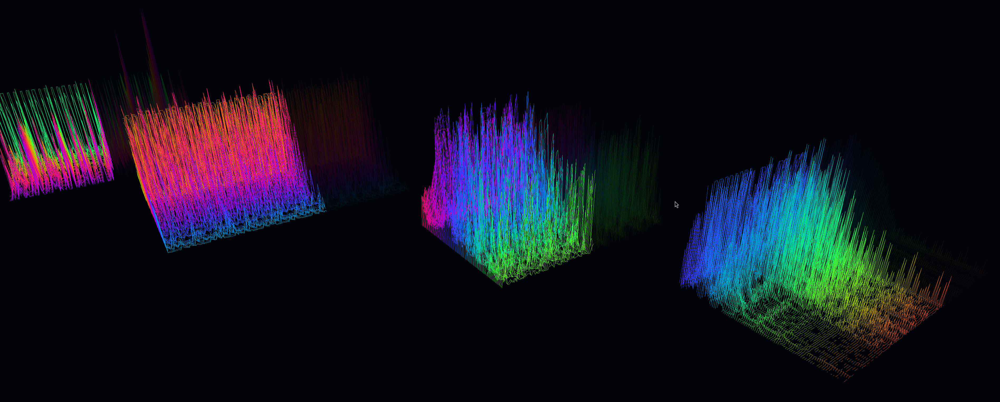

Odin Waveform 3D Visualizer (raylib)
===================================

Detta är ett litet projekt som visar hur man visualiserar .wav-filer i 3D med ren Odin och raylib.

Förutsättningar (Linux):
- Odin compiler (https://odin-lang.org/) - minst en modern version
- raylib development libraries (libraylib-dev eller bygg från källkod)

Snabbstart (exempel, justera efter din distribution):

1) Installera beroenden (Debian/Ubuntu-exempel):

```bash
sudo apt install build-essential pkg-config libraylib-dev
```

2) Bygg programmet:

```bash
cd musicgame
# Försök bygga hela src-mappen med Odin. Du kan behöva lägga till linker-flaggor beroende på din installation.
odin build src -out:waveviz -v
```

Om build-kommandot misslyckas, kör med explicita link-flaggor (exempel):

```bash
odin build src -out:waveviz -ldflags "-lraylib -lm -lpthread -ldl -lrt -lX11 -lGL"
```

3) Kör programmet:

```bash
./waveviz path/to/file.wav
```

Next steps
- Implementera WAV-laddaren i `src/wav.odin`
- Implementera raylib-bindningar i `src/raylib_bindings.odin`
- Implementera 3D-rendering i `src/main.odin`

Se filerna i `src/` för mer information.
